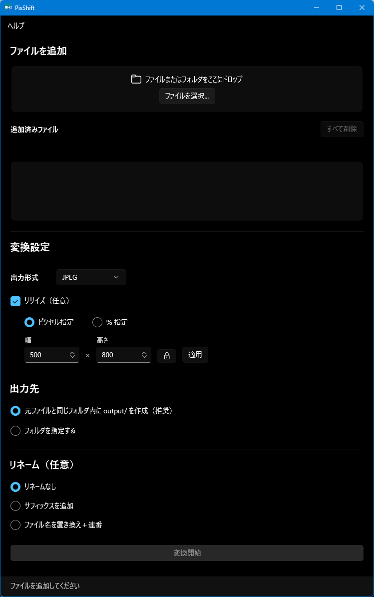
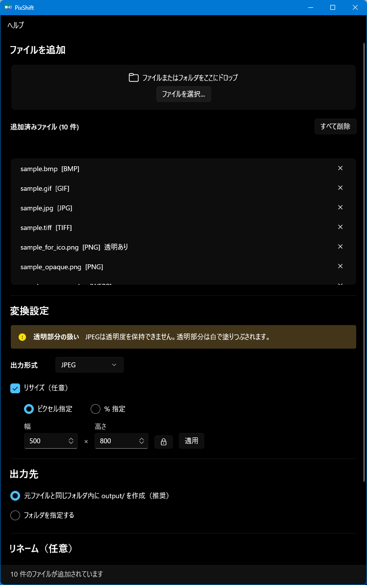

# Quadivert

画像ファイルの形式変換・リサイズツール（Windows デスクトップアプリ）

 

## 概要

Quadivert は、画像ファイルの形式変換とリサイズをまとめて行える Windows 向けデスクトップアプリです。
ドラッグ＆ドロップで複数ファイルをまとめて変換できます。

## 機能

- **対応入力形式**: PNG / JPEG / WebP / BMP / TIFF / GIF / HEIC・HEIF
- **対応出力形式**: PNG / JPEG / WebP / BMP / TIFF / GIF / ICO
- ドラッグ＆ドロップでファイル・フォルダをまとめて追加
- バッチ変換（複数ファイルを一括処理）
- リサイズ（ピクセル指定 / % 指定、アスペクト比ロック）
- ICO 変換時は 16 / 32 / 48 / 256px を自動生成
- 透明度をもつ画像を JPEG に変換する場合は白背景に自動合成（警告あり）
- 変換後のファイル名にサフィックス追加 / 連番付き一括リネーム
- 同名ファイルが存在する場合は自動リネーム（元ファイルへの上書きなし）
- 設定の永続化（ウィンドウ位置・変換設定・リネーム設定）

## 動作環境

- Windows 10 バージョン 1809（ビルド 17763）以降、または Windows 11
- x64（64 ビット）環境

## インストール

### 1. Windows App SDK ランタイムのインストール（初回のみ）

以下のページから **Windows App SDK 2.1** のインストーラーをダウンロードして実行してください。

https://learn.microsoft.com/ja-jp/windows/apps/windows-app-sdk/downloads

ページ内「バージョン 2.1」欄の「インストーラー (x64)」を選択してください。

> Windows 11 最新バージョンでは不要な場合があります。  
> 起動時にエラーが表示された場合はランタイムをインストールしてから再度お試しください。

### 2. アプリの起動

[Releases](../../releases) から最新の zip をダウンロードして解凍し、`Quadivert.exe` をダブルクリックするだけで起動できます。インストール不要です。

### HEIC / HEIF を使用する場合

Microsoft Store から **「HEIF イメージ拡張機能」** を無料でインストールしてください。

## 注意事項

- **アニメーション GIF**: アニメーション GIF を変換した場合、先頭フレームのみが出力されます。アニメーションは保持されません。
- **元ファイルの安全**: 変換・リサイズ処理は元ファイルを変更しません。出力は常に別ファイルとして生成されます。

## アップデートの確認

新しいバージョンは [Releases ページ](../../releases) で公開しています。定期的にご確認ください。

## 初回起動時の警告について

配布ファイルはコード署名を行っていないため、Windows の SmartScreen により警告が表示される場合があります。
「詳細情報」→「実行」を選択することで起動できます。

## ライセンス

MIT License — 詳細は [LICENSE](LICENSE) を参照してください。

使用しているサードパーティライブラリのライセンスについても LICENSE ファイルに記載しています。
